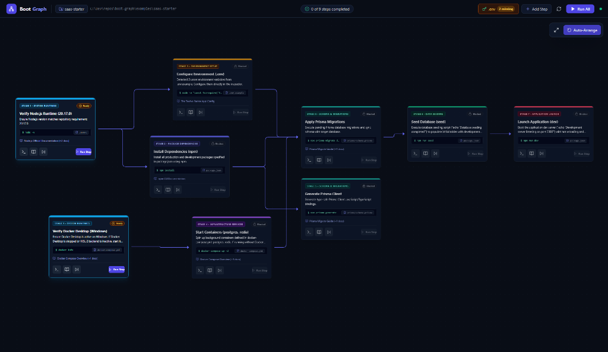

# BootGraph

An interactive visual setup and dependency pipeline for any codebase.

BootGraph inspects your repository, figures out its runtime and service dependencies, and turns your setup process into a clear, executable graph in your browser.



```bash
# Run inside any repository
npx bootgraph

# Or test-drive the included full-stack SaaS example
npx bootgraph -w ./examples/saas-starter
```

---

## Try the Included Example

BootGraph includes a complete full-stack boilerplate in `examples/saas-starter` featuring Node.js, Docker Compose (PostgreSQL and Redis), Prisma migrations, environment variables, seed scripts, and dev server launch steps.

To inspect and test-drive the example:

```bash
# From the repository root
npx bootgraph -w ./examples/saas-starter

# Or navigate directly into the folder
cd examples/saas-starter
npx bootgraph
```

BootGraph will launch the interactive canvas at `http://localhost:4000` with the complete 7-stage pipeline rendered and ready to inspect.

---

## Why BootGraph?

Setting up a project for the first time is often painful:

- A database container needs to run, but nobody documented it.
- Migrations fail because the database was still starting up.
- A required environment variable was added months ago, but your `.env` is missing it.
- Setup instructions are scattered across `package.json`, `docker-compose.yml`, `Makefile`, and stale READMEs.

BootGraph removes the guesswork. It reads your codebase, figures out what needs to run first, and gives you a visual pipeline you can run step by step.

---

## Features

### 1. Interactive Dependency Canvas

The main view shows your setup as a clean, directional graph organized into logical stages.


- **Live Statuses**: Every step clearly displays whether it is Ready, Blocked, Running, Completed, Failed, or Skipped.
- **Topological Order**: Directional edges show prerequisites and what needs to happen next.
- **Responsive Framing**: Pan, zoom, and fit the graph to your display with automatic camera compensation when the terminal is open.
- **Flexible Execution**: Run individual steps or click "Run All" to execute the entire pipeline in order.

---

### 2. Integrated Terminal & Instant Log Copy

Run commands and monitor output without switching terminal windows.


- **Live ANSI Logs**: Streams stdout and stderr directly through an embedded xterm.js terminal.
- **One-Click Copy**: Instantly copy full terminal output to your clipboard for quick debugging.
- **Process Control**: Stop long-running tasks or re-run steps with one click.

---

### 3. Environment Variable Manager (.env)

Audit and configure environment variables before launching your application.


- **Missing Key Detection**: Compares your local `.env` with `.env.example` and flags missing keys in the top bar.
- **Inline Editing**: Add and update values directly in the browser.
- **Secret Masking**: Sensitive keys and passwords are masked by default with visibility toggles.
- **Direct Save**: Writes updates directly back to your local `.env` file.

---

### 4. Step Inspector & Live Documentation

Inspect the technical context behind any step in the pipeline.


- **Source File Anchors**: Jump directly to the file and config block that defined the step (e.g. `docker-compose.yml`, `package.json`, `schema.prisma`).
- **Official Documentation**: Contextual links to official reference docs for detected frameworks and runtimes.
- **Extracted README Context**: Surfaces relevant setup sections from your repository's README.
- **In-Memory Tweaks**: Adjust commands or descriptions for your active session and apply them immediately.

---

### 5. Custom Steps

Add project-specific build scripts, seeds, or validation checks directly into the graph.


- **Stage Assignment**: Place new steps into any of the 7 lifecycle tiers.
- **Dependency Links**: Wire prerequisites so custom scripts run only when dependencies are met.
- **Canvas Wiring**: Connect and disconnect nodes on the canvas to customize your workflow.

---

### 6. Automatic Scanner & 7 Lifecycle Tiers

BootGraph scans your repository with zero configuration needed:

- **Runtimes**: Node.js (`.nvmrc`), Python (`pyproject.toml`), Go (`go.mod`), Rust (`Cargo.toml`).
- **Package Managers**: npm, pnpm, yarn, bun, pip, poetry.
- **Containers**: `docker-compose.yml` (services, ports, environment).
- **Databases**: Prisma, Drizzle, Alembic.
- **Scripts**: npm scripts, `Makefile`, `Justfile`.

Steps are arranged across seven deterministic tiers:

| Tier | Lifecycle Stage | Description |
| :---: | :--- | :--- |
| **1** | System Runtimes | Checks host interpreters and Docker daemon availability. |
| **2** | Package Dependencies | Installs third-party packages and dependencies. |
| **3** | Environment Setup | Checks and configures required `.env` values. |
| **4** | Infrastructure Services | Starts background containers and databases. |
| **5** | Schema & Migrations | Generates client libraries and applies migrations. |
| **6** | Data Seeding | Loads default records and development fixtures. |
| **7** | Application Launch | Starts dev servers, background workers, and watchers. |

---

### 7. Non-Blocking Readiness Probes

A started container is not always ready for traffic. BootGraph uses non-blocking TCP socket and command probes to confirm service availability before unlocking dependent steps, preventing connection errors during startup.

---

## Architecture Overview

```
+--------------------------------------------------------------+
|                     Target Repository                        |
|   (package.json, docker-compose.yml, .env.example, README)   |
+------------------------------+-------------------------------+
                               | Scan & Inspect
+------------------------------v-------------------------------+
|                    BootGraph CLI Daemon                      |
|                                                              |
|  - Manifest Scanners (Modular Heuristic Analyzers)           |
|  - Documentation Enricher (File Anchors & Doc Lookups)       |
|  - Topological DAG Engine (Cycle Detection & Tier Mapping)   |
|  - Process Runner (Real-Time Subprocess & Pseudo-Terminal)   |
|  - Readiness Probes (TCP Socket & Health Verification)       |
|  - Embedded HTTP & WebSocket Server (Hono & ws)              |
+------------------------------+-------------------------------+
                               | Bidirectional WebSocket & HTTP
+------------------------------v-------------------------------+
|                    BootGraph Web Canvas                      |
|                                                              |
|  - React Flow Directed Acyclic Graph Canvas                  |
|  - Integrated xterm.js Terminal Drawer                       |
|  - Step Inspector & Live Documentation Modal                 |
|  - Environment Variable Manager                              |
|  - Custom Step Creator                                       |
+--------------------------------------------------------------+
```

---

## CLI Options

```bash
bootgraph [options]

Options:
  -v, --version           Show version number
  -p, --port <port>       Port for the web canvas (default: 4000)
  -w, --workspace <path>  Target repository path (default: current directory)
  --no-open               Skip opening the browser automatically
  -h, --help              Show help
```

---

## Optional Configuration (`.bootgraph.json`)

BootGraph is zero-config by default. If your team wants to declare custom overrides or register project-specific steps in source control, you can optionally place a `.bootgraph.json` file in your repository root:

```json
{
  "$schema": "https://bootgraph.dev/schema.json",
  "name": "my-service",
  "overrides": {
    "db-migrate": {
      "command": "npx prisma migrate deploy"
    }
  },
  "customNodes": [
    {
      "id": "seed-admin",
      "name": "Seed Admin User",
      "tier": 6,
      "command": "node scripts/seed-admin.js",
      "requires": ["db-migrate"]
    }
  ]
}
```

---

## Development & Contributing

### Prerequisites

- Node.js >= 20.0.0
- npm >= 9.0.0

### Local Setup

```bash
# Clone the repository
git clone https://github.com/hmani3/boot-graph.git
cd boot-graph

# Install dependencies
npm install

# Run test suites
npm test

# Build both server and client bundles
npm run build

# Start the CLI in development mode
npm run dev

# Or test against the example during development
npm run dev -- -w ./examples/saas-starter
```

---

## License

MIT
